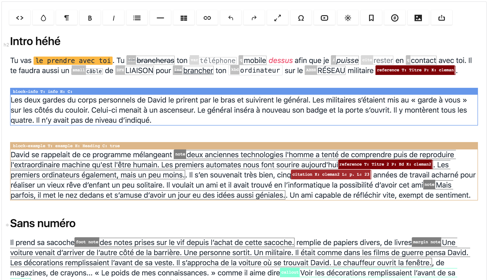

<h1 align="center">at-article-redactor-plugin</h1> <br>
<div align="center">
  <a href="https://imperavi.com/redactor/">Imperavi Redactor</a> plugins for writing clean and flat articles with <a href="https://github.com/michaelravedoni/at-article">at-article</a>
</div>

<div align="center">
  <sub>Built with ❤︎ by
  <a href="https://michael.ravedoni.com/en">Michael Ravedoni</a> and
  <a href="https://github.com/michaelravedoni/at-article-redactor-plugins/contributors">
    contributors
  </a>
</div>

## Introduction

This repo contains 7 redactor plugins. Each plugin adds a button to toolbar of the rich text editor powered by [Redactor](https://imperavi.com/redactor/) by Imperavi.



## Craft CMS 3
For a [Craft CMS 3.0.0-RC15](https://github.com/craftcms/redactor) or later configuration.

### Installation
Add the plugins in your `config/redactor/` folder. You can either place the plugin directly in that folder, or within a subfolder that is named after the plugin:

```json
config/
└── redactor/
    └── plugins/
        ├── at-format.js
        └── at-inline/
            ├── at-inline.js
            └── at-inline.css
```

### Configuration

In your `config/redactor/` folder, you will find all the custom Redactor JSON configs fils that will be available to your Redactor fields in Craft CMS. For example, if you created a `config/redactor/Standard.json` file with the following content:

```json
{
  "buttons": ["html", "format", "bold", "italic", "lists", "link", "file"],
  "plugins": ["fullscreen"]
}
```

…then a “Standard” option would become available within the “Redactor Config” setting on your Redactor field’s settings. See the [Redactor documentation](https://imperavi.com/redactor/docs/settings/) for a list of available config options and buttons.

To enable one of the plugin (for example `at-format`), just add the plugin handle to the `plugin` array in your Redactor JSON config.

```json
{
  "plugins": ["fullscreen", "at-format"]
}
```

## Redactor 2
For a [Redactor 2](https://imperavi.com/redactor/docs/get-started/initialization/) configuration.

### Installation
Download the latest plugin archive from the [release branch][github-branch-release]
or [releases page][github-releases]. Extract the downloaded archive to the plugin directory of your Redactor installation.

Then, place one of the 7 plugins in your page after embedding `redactor.js`:

```html
<!-- redactor js -->
<script src="/your-folder/redactor.js"></script>

<!-- plugin js -->
<script src="/your-folder/plugins/at-citation.js"></script>
<script src="/your-folder/plugins/at-components.js"></script>
<script src="/your-folder/plugins/at-format.js"></script>
<script src="/your-folder/plugins/at-inline.js"></script>
<script src="/your-folder/plugins/at-inspector.js"></script>
<script src="/your-folder/plugins/at-reference.js"></script>
<script src="/your-folder/plugins/at-references.js"></script>
```

### Configuration

Add `at-*` (for example `at-format`) to the list of your Redactor plugins.

```javascript
$R('#editor', {
  plugins: ['at-format', 'at-*', 'etc.'],
})
```

## Usage
Comming soon…

## Contributing

We’re really happy to accept contributions from the community, that’s the main reason why we open-sourced it! There are many ways to contribute, even if you’re not a technical person.

1. Fork it (<https://github.com/michaelravedoni/at-article-redactor-plugins/fork>)
2. Create your feature branch (`git checkout -b feature/fooBar`)
3. Commit your changes (`git commit -am 'Add some fooBar'`)
4. Push to the branch (`git push origin feature/fooBar`)
5. Create a new Pull Request

## Release History

You will find the releases history in the [release](https://github.com/michaelravedoni/at-article-redactor-plugins/releases) section. For more detail, you can check the [changelog.md](https://github.com/michaelravedoniat-article-redactor-plugins/blob/master/CHANGELOG.md) file.

## Roadmap

- `at-reference.js` automatic fill fields with an url, doi or isbn

## Authors and acknowledgment

* **Michael Ravedoni** - *Initial work* - [michaelravedoni](https://github.com/michaelravedoni)

See also the list of [contributors](https://github.com/michaelravedoni/at-article-redactor-plugins/contributors) who participated in this project.

## License

[MIT License](https://opensource.org/licenses/MIT)
